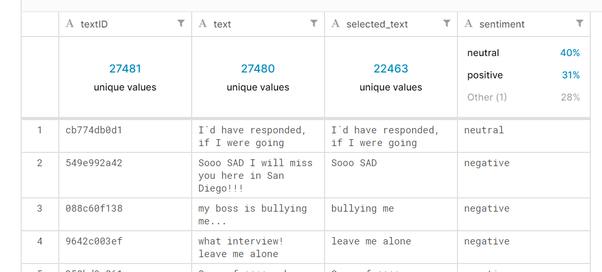
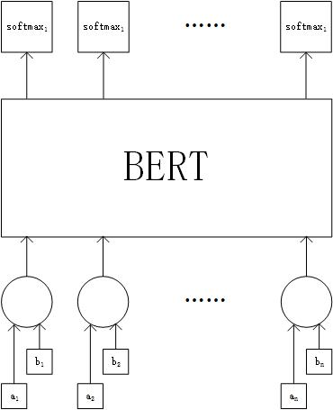
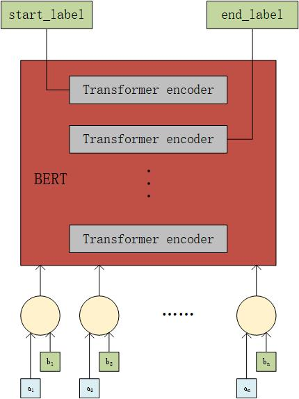

# Tweet-sentiment-extraction
Tweet sentiment extraction是kaggle的一个比赛，这个代码主要是想尝试利用BERT模型实现词语抽取。
其比赛链接：[https://www.kaggle.com/c/tweet-sentiment-extraction/](https://www.kaggle.com/c/tweet-sentiment-extraction)

比赛背景：
在日常的微博传播背后，其情绪会影响公司或者个人的决策。捕捉情绪语言能够立刻让人们了解到语言中的情感，从而可以有效
指导决策。但是,哪些词实际上主导情绪描述，这就需要我们模型能够有效挖掘出来。

比如给定一个句子："My ridiculous dog is amazing." [sentiment: positive]。这个句子的情感为positive(积极)，则比赛需要我们抽取出
能够充分表达这个积极情感信息的词语，比如句子中的“amazing”这个词语可以表达positive情感。

# 1.前言
## 1.1 Required

```
bert-tensorflow
1.15 > tensorflow > 1.12 
tensorflow-hub
```

## 1.2 分析给定的数据
比赛中给定了两个数据集：train.csv和test.csv。利用train.csv数据来构造模型，并预测test.csv数据。

train.csv的具体数据结构如下：



- textID: 文本id
- text： 原始文本
- selected_text： 抽取出来的，带有情感的文本
- sentiment：句子的情感

## 1.3 构造模型输入和输出
初步想法是把“text”和“sentiment”进行拼接，构造成"[CLS] text_a [SEP] text_b [SEP]"。输出是对每个词语进行当前输出，
输出有两个值，分别为0（不需要抽取该词语）和1（需要抽取该词语）。

具体的结构图如下：



# 2.代码实现
## 2.1 预加载模型的下载
首先要新建两个文件夹“bert_pretrain_model”和“save_model”
- bert_pretrain_model: BERT模型下载到这里，并进行解压。具体模型下载连接：
[https://github.com/google-research/bert](https://github.com/google-research/bert)
- save_model: python3 model.py 之后模型会保存到这里

## 2.2 BERT模型文件
BERT模型下载后是一个压缩包，类似于uncased_L-12_H-768_A-12.zip。里面包含了四个文件：
- bert_config.json：BERT模型参数
- bert_model.ckpt.xxxx：这里有两种文件，但导入模型只需要bert_model.ckpt这个前缀就可以了
- vocab.txt：存放词典

## 2.3 构造输入tf.data.dataset
主要实现在[run_classifier_custom.py](./run_classifier_custom.py)

总共构造了7个输入形式：
```python
d = tf.data.Dataset.from_tensor_slices({
    "input_ids":
        tf.constant(
            all_input_ids, shape=[num_examples, seq_length],
            dtype=tf.int32),
    "input_mask":
        tf.constant(
            all_input_mask,
            shape=[num_examples, seq_length],
            dtype=tf.int32),
    "segment_ids":
        tf.constant(
            all_segment_ids,
            shape=[num_examples, seq_length],
            dtype=tf.int32),
    "label_id_list":
        tf.constant(all_label_id_list, shape=[num_examples, seq_length], dtype=tf.int32),
    "sentiment_id":
        tf.constant(all_sentiment_id, shape=[num_examples], dtype=tf.int32),
    "texts":
        tf.constant(all_texts, shape=[num_examples], dtype=tf.string),
    "selected_texts":
        tf.constant(all_selected_texts, shape=[num_examples], dtype=tf.string),
})
```
- input_ids: 把词语进行分词之后，分配的词典id
- input_mask： 可以对哪些位置进行mask操作
- segment_ids： 区分text_a和text_b的id
- label_id_list：标记哪些词语需要被抽取的
- sentiment_id：该句子的情感id
- texts：原始句子
- selected_texts：需要抽取的词语

## 2.4 模型评估
模型评估需要重新恢复构建的词语，代码在[train.py](./train.py)

```python
def eval_decoded_texts(texts, predicted_labels, sentiment_ids, tokenizer):
    decoded_texts = []
    for i, text in enumerate(texts):
        if type(text) == type(b""):
            text = text.decode("utf-8")
        # sentiment "neutral" or length < 2
        if sentiment_ids[i] == 0 or len(text.split()) < 2:
            decoded_texts.append(text)

        else:
            text_list = text.lower().split()
            text_token = tokenizer.tokenize(text)
            segment_id = []

            # record the segment id
            j_text = 0
            j_token = 0
            while j_text < len(text_list) and j_token < len(text_token):
                _j_token = j_token + 1
                text_a = "".join(tokenizer.tokenize(text_list[j_text])).replace("##", "")
                while True:
                    segment_id.append(j_text)
                    if "".join(text_token[j_token:_j_token]).replace("##", "") == text_a:
                        j_token = _j_token
                        break
                    _j_token += 1
                j_text += 1
            assert len(segment_id) == len(text_token)

            # get selected_text
            selected_text = []
            predicted_label_id = predicted_labels[i]
            predicted_label_id.pop(0)
            for _ in range(len(predicted_label_id) - len(text_token)):
                predicted_label_id.pop()

            max_len = len(predicted_label_id)
            assert len(text_token) == max_len
            j = 0
            while j < max_len:
                if predicted_label_id[j] == 1:
                    if j == max_len - 1:
                        j += 1
                    else:
                        a_selected_text = text_list[segment_id[j]]
                        selected_text.append(a_selected_text)
                        for new_j in range(j + 1, len(segment_id)):
                            if segment_id[j] != segment_id[new_j]:
                                j = new_j
                                break
                            elif new_j == len(segment_id) - 1:
                                j = new_j
                else:
                    j += 1

            decoded_texts.append(" ".join(selected_text))

    return decoded_texts
```

## 2.5 train and test
- train
```
python3 train.py
```

- test
```
python3 test.py
```

最后会生成可以提交的csv文件：[submission.csv](./input_data/submission.csv)

## 3. version 2

### 3.1 数据清洗
目前发现在数据集上，selected_text中没有进行数据清洗，里面有很多缺失的词语。
通常在开头和结尾处，词语显示不完整。比如：
```
text: happy birthday
selected_text: y birthday
```
上面在开头缺少了“happy”这个词语，所以需要补上。

同时也存在两个单词没有空格开，比如
```
text: birthday,say say
selected_text: say say
```

具体清洗代码可以看：[process_data.py](process_data.py)

### 3.2 模型方法

更新了新的模型预测方法，具体方法见[util.py下的eval_decoded_texts_in_position方法](util.py)

主要考虑到预测出来的词语中，可能是经过分词器分成的多个部分的词语，因此需要重新还原该词语。

比如：
```
text: birthday
predict： ##day
```
这时候需要重新构造整个“birthday”词语，这才是正确的预测方法。

## 4. version 3
**更改了训练方法。**

上面的第一个版本是直接预测每个单词是否需要抽取，这就需要同时构造多个分类器。观望了一下
原始数据集，发现抽取到的文本是连续的文本，那么就可以直接标记起始位置(start_label)和结尾位置(end_label)，作为预测label
这时候原始的N个分类器可以缩减到2个分类器。

本身BERT训练的时候，encoder上共有12层layer。实验中使用了最后的一层layer预测start_label,
使用倒数第二层预测end_label，这样就可以构造两个分类器来进行预测。

- 模型如下所示：



- 代码实现在[train.py](train.py)

```python
def create_model(bert_config, is_training, is_predicting, input_ids, input_mask, segment_ids,
                 target_start_idx, target_end_idx, num_labels, use_one_hot_embeddings):
    """Creates a classification model."""
    model = modeling.BertModel(
        config=bert_config,
        is_training=is_training,
        input_ids=input_ids,
        input_mask=input_mask,
        token_type_ids=segment_ids,
        use_one_hot_embeddings=use_one_hot_embeddings)

    # Use "pooled_output" for classification tasks on an entire sentence.
    # Use "sequence_output" for token-level output.
    # "get_all_encoder_layers" for all encoder layer
    all_layer = model.get_all_encoder_layers()  # output_layer: 12 layer * [N, max_len, 768]

    hidden_size = all_layer[-1].shape[-1].value
    max_len = all_layer[-1].shape[1].value

    # Create our own layer to tune for politeness data. shape:[N, max_length, num_labels]
    with tf.variable_scope("first_softmax_llq", reuse=tf.AUTO_REUSE):
        output_weights = tf.get_variable("output_weights", [num_labels, 2 * hidden_size],
                                         initializer=tf.truncated_normal_initializer(stddev=0.02))

        output_bias = tf.get_variable("output_bias", [num_labels], initializer=tf.zeros_initializer())

    with tf.variable_scope("loss"):
        output_layer = tf.concat([all_layer[-1], all_layer[-2]], axis=-1)

        # Dropout helps prevent overfitting
        output_layer = tf.layers.dropout(output_layer, rate=0.1, training=is_training)

        # softmax operation
        logits = tf.einsum("nlh,hm->nlm", output_layer, tf.transpose(output_weights))
        logits = tf.nn.bias_add(logits, output_bias)
        # logits_probs = tf.nn.log_softmax(logits, axis=-1)
        start_logits_probs, end_logits_probs = tf.split(logits, 2, axis=-1)
        start_logits_probs = tf.squeeze(start_logits_probs, axis=-1)
        end_logits_probs = tf.squeeze(end_logits_probs, axis=-1)

        # Convert labels into one-hot encoding
        one_hot_start_idx = tf.one_hot(target_start_idx, depth=max_len, dtype=tf.float32)
        one_hot_end_idx = tf.one_hot(target_end_idx, depth=max_len, dtype=tf.float32)

        one_hot_start_labels = tf.one_hot(tf.argmax(start_logits_probs, axis=-1), depth=max_len, dtype=tf.int32, axis=-1)
        one_hot_end_labels = tf.one_hot(tf.argmax(end_logits_probs, axis=-1), depth=max_len, dtype=tf.int32, axis=-1)
        predicted_labels = one_hot_start_labels + one_hot_end_labels

        # If we're predicting, we want predicted labels and the probabiltiies.
        if is_predicting:
          return (predicted_labels, logits)

        # If we're train/eval, compute loss between predicted and actual label
        loss = tf.keras.backend.sparse_categorical_crossentropy(target_start_idx, start_logits_probs, from_logits=True)
        loss += tf.keras.backend.sparse_categorical_crossentropy(target_end_idx, end_logits_probs, from_logits=True)
        loss = tf.reduce_mean(loss)
        return (loss, predicted_labels, logits)
```